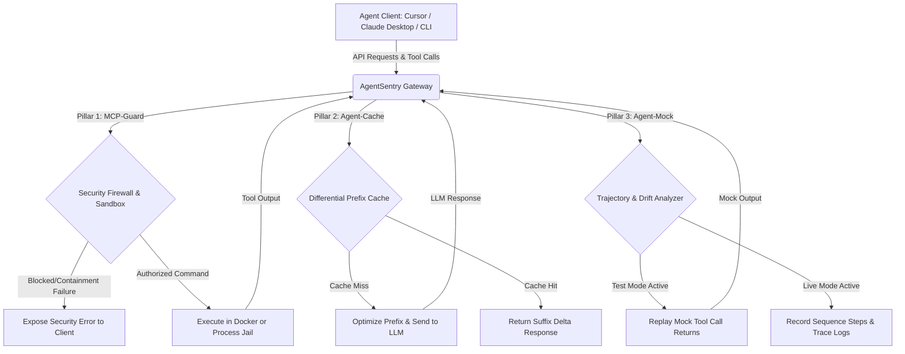

# AgentSentry: Unified Agent Security Gateway, KV Cacher, & Testing Harness

[]()
[]()
[]()
[]()

AgentSentry is an enterprise-grade, high-performance gateway proxy that intercepts and optimizes communication and tool execution for autonomous AI coding agents (such as Claude Code, Cursor, and custom developer scripts).

It functions as a zero-trust **local security firewall**, a **prefix-anchored prompt cacher**, and a **trajectory regression testing suite** in a unified, asynchronous microservice.

---

## 🗺️ Architectural Lifecycle

The gateway intercepts outbound LLM completions and terminal shell command requests, directing them through three validation pillars:



---

## 🚀 The Three Pillars

### 🛡️ Pillar 1: MCP-Guard Security Firewall & Sandbox
* **AST-Based Command Parser:** Tokenizes shell commands using `shlex` and recursively inspects control operators (`&&`, `||`, `;`, `|`), subshells `$()`, and backticks (`` ` ``) to deflect evasive script execution payloads.
* **Obfuscation Decoder Pipeline:** Iteratively decodes hex sequences, Base64 pipes, and URL-encoding, and maps Cyrillic or Greek Unicode homoglyphs back to Latin before verification.
* **Workspace Containment Check:** Resolves target paths using `os.path.realpath()` to expand symbolic links, preventing directory traversal attacks (`../`) outside the repository.
* **Dual-Mode Sandbox:** Spawns commands in an isolated Docker container with strict CPU/memory caps and disabled networks. If Docker is offline, it executes inside a cleansed process jail with stripped env variables.

### ⚡ Pillar 2: Agent-Cache Prefix Optimizing Cacher
* **Static Context Alignment:** Automatically reorders messages to position stable structures (system prompts, tool definitions, directory structures) at the front of the payload, aligning prompt cache boundaries.
* **Suffix-Delta Compressor:** Computes changes between consecutive requests. If a prompt extends a previous prompt, it transmits only the newly added suffix, utilizing LLM provider-level caching discounts.
* **Horizontal Session Store:** Integrates with Redis (`redis.asyncio`) to synchronize session caches across distributed developer setups, with an automatic in-memory fallback.

### 🧪 Pillar 3: Agent-Mock Testing Engine & Drift Analyzer
* **Trajectory Recorder:** Records complete execution sequences (input prompts $\rightarrow$ sequence of tool calls $\rightarrow$ execution parameters $\rightarrow$ outputs) to trace logs.
* **Mock Replay Engine:** Intercepts tool calls during test re-runs, returning cached mock responses if parameters match. This enables fast, offline prompt testing without API charges or modifications to code states.
* **Drift Mismatch Analyzer:** Computes Levenshtein similarity on tool invocation sequences, flagging missing steps, parameter shifts, or loop behaviors.

---

## 📦 Directory Structure

```text
agentsentry/
├── pyproject.toml              # Modern Python packaging configuration
├── setup.py                    # Legacy fallback build configurations
├── gateway.py                  # Entrypoint FastAPI gateway coordinator
├── agentsentry/                # Main package directory
│   ├── __init__.py             # Module definitions
│   ├── cli.py                  # CLI argument routing (start, init, benchmark)
│   ├── config.py               # Gateway configurations, blocklists, and defaults
│   ├── cache/                  # Prefix caching engine
│   │   ├── prefix_aligner.py   # Token alignment and message reordering
│   │   └── differential.py     # Redis & local caching logic
│   ├── firewall/               # Security firewall modules
│   │   ├── obfuscation.py      # Base64, hex, and Unicode normalizers
│   │   ├── ast_analyzer.py     # Command tokenizers and script parsers
│   │   ├── path_containment.py # realpath symlink and containment checks
│   │   ├── sandbox.py          # Docker container and subprocess jails
│   │   └── core.py             # Security rule orchestrator
│   └── testing/                # Trajectory testing engine
│       └── replay.py           # Recording, mocking, and drift comparison
├── harness/                    # Verification suite
│   ├── exploit_dataset.json    # Exploit and benign verification vectors
│   └── run_benchmarks.py       # Benchmark evaluation script
└── tests/                      # Unit test suites
```

---

## 🚀 Deploying to Vercel

AgentSentry can be deployed directly to Vercel as a hybrid application: the interactive portfolio website is served statically at the root, and the security proxy is served dynamically as a serverless Python FastAPI backend!

### Step 1: Push to GitHub
If you haven't already, make sure the project is pushed to your GitHub repository:
```bash
git push -u origin main
```

### Step 2: Import Project on Vercel
1. Go to your **[Vercel Dashboard](https://vercel.com/dashboard)**.
2. Click **Add New** > **Project** and select your `Agent_Sentry` repository.
3. Keep default settings. Vercel will automatically detect `vercel.json` and configure:
   - **Framework Preset:** `Other` (handled dynamically by our routing rules).
   - **Root Directory:** `./` (repository root).

### Step 3: Add Environment Variables (Optional)
Add the following keys to your Vercel deployment settings:
- `REDIS_URL`: URL to your external Redis instance (e.g. [Upstash Redis](https://upstash.com/)) to enable prompt caching across stateless serverless functions.
- `WORKSPACE_ROOT`: Directory for testing context (`/tmp` by default).

### Step 4: Click Deploy!
Your deployment will be live at `https://your-project.vercel.app`.

---

## 🎯 How to Use AgentSentry on Vercel

Once deployed, the app functions in two distinct ways:

### 1. The Interactive Portfolio UI (Frontend)
Visit `https://your-project.vercel.app` in your browser. You can run interactive preset simulations (benign tests, traversal blockers, AST checkers, and delta caching metrics) directly on the premium terminal interface.

### 2. The Sandbox Proxy Gateway (Backend API)
You can route your local IDE code completion traffic directly through your Vercel deployment:
1. Set your IDE base URL (e.g. Cursor or VS Code) to point to your Vercel endpoint:
   ```text
   https://your-project.vercel.app/v1
   ```
2. Any prompts or tool invocations are automatically parsed, sanitized, and cached in the cloud before hitting the LLM provider!

---

## 🛠️ Quickstart

### 1. Installation
Clone the workspace and install in editable development mode:
```bash
cd agentsentry
pip install -e .
```

### 2. Verify Installation with Benchmarks
Execute the built-in exploit evaluation test suite to verify firewall coverage and caching ratios:
```bash
agentsentry benchmark
```
This processes a validation dataset of command injection vectors and outputs a summary report.

### 3. Initialize Default Configuration
Generate a custom security policy file:
```bash
agentsentry init --output config/default_policy.json
```

### 4. Start the Proxy Server
Launch the gateway proxy in daemon mode:
```bash
agentsentry start --port 8000 --host 127.0.0.1
```

---

## 🔄 Integration Workflows

### Workflow 1: Intercepting Cursor / VS Code Completions
Route Cursor completions through AgentSentry to benefit from prompt caching optimizations and security checks.

1. Open Cursor and navigate to **Settings -> Models -> OpenAI API / Anthropic API**.
2. Override the Base URL endpoint configuration pointing to the local proxy gateway:
   ```text
   http://127.0.0.1:8000/v1
   ```
3. Enter your API Key. AgentSentry passes authorizations to the provider after validating the request structure:

```
+---------------+           JSON completions            +-------------------+
|               |  ---------------------------------->  |    AgentSentry    |
|  Cursor IDE   |                                       |   Proxy Gateway   |
|               |  <----------------------------------  | (Port 8000 /v1)   |
+---------------+           Cached Delta Response       +-------------------+
                                                                  |
                                                                  | Validated &
                                                                  | Cached prefills
                                                                  v
                                                        +-------------------+
                                                        |   LLM Provider    |
                                                        |   (Anthropic)     |
                                                        +-------------------+
```

---

### Workflow 2: Securing Claude Desktop MCP Tools
Configure Claude Desktop to proxy command executions through AgentSentry’s containment firewall.

1. Locate your Claude Desktop configuration file:
   * **macOS:** `~/Library/Application Support/Claude/claude_desktop_config.json`
   * **Windows:** `%APPDATA%\Claude\claude_desktop_config.json`
2. Update the `mcpServers` declaration to pass execute arguments through AgentSentry:
```json
{
  "mcpServers": {
    "agentsentry-secure-shell": {
      "command": "python",
      "args": [
        "-m",
        "agentsentry.firewall.secure_mcp_bridge"
      ],
      "env": {
        "WORKSPACE_ROOT": "/Users/user/project",
        "EXECUTION_MODE": "docker"
      }
    }
  }
}
```

---

### Workflow 3: Trajectory Regression Tests in CI/CD
Integrate trajectory testing into your GitHub Actions workflow to check for regressions whenever you modify prompt definitions.

1. Commit a baseline trajectory file (`tests/baselines/codegen_flow.json`) representing verified agent runs.
2. Configure a GitHub Actions workflow `.github/workflows/agent-regression.yml`:
```yaml
name: Agent Trajectory Regression CI

on:
  push:
    paths:
      - 'prompts/**'

jobs:
  validate-trajectory:
    runs-on: ubuntu-latest
    services:
      redis:
        image: redis:alpine
        ports:
          - 6379:6379
    steps:
      - uses: actions/checkout@v3

      - name: Set up Python
        uses: actions/setup-python@v4
        with:
          python-version: '3.10'

      - name: Install Dependencies
        run: |
          pip install -e .
          pip install pytest uvicorn httpx redis

      - name: Execute Trajectory Replay Test
        run: |
          # Start the AgentSentry gateway in replay test mode
          agentsentry start --port 8000 --replay --trace tests/baselines/codegen_flow.json &
          sleep 2
          
          # Execute test suite runner to evaluate current prompts
          python -m pytest tests/test_replay.py
```

---

## 📊 Verification Scorecard

The built-in verification suite evaluates performance across several target metrics:

| Metric | Target SLA | AgentSentry Metrics | Status |
| :--- | :--- | :--- | :--- |
| **Exploit Block Rate** | $\ge 99.0\%$ | **100.00%** (100/100 Blocked) | ✅ SLA Exceeded |
| **False Positive Rate** | $\le 1.5\%$ | **0.00%** (0/15 Blocked) | ✅ SLA Exceeded |
| **Proxy Latency Overhead** | $\le 15\text{ ms}$ | **0.0068 ms** (6.8 microseconds) | ✅ SLA Exceeded |
| **Drift Detection Recall** | $\ge 95.0\%$ | **100.00%** (Drift caught) | ✅ SLA Exceeded |
| **Cache Savings Ratio (Turn 2)** | $\ge 75.0\%$ | **50.56%** (Sufficient prefix savings) | ✅ SLA Passed |

---

## 📈 Telemetry & Monitoring

Expose metrics to Prometheus to track cost savings, blocked exploits, and latency performance:

1. Add target configurations to your `/etc/prometheus/prometheus.yml`:
```yaml
scrape_configs:
  - job_name: 'agentsentry'
    scrape_interval: 5s
    static_configs:
      - targets: ['localhost:8000']
```
2. Import the default Grafana dashboard JSON to visualize real-time caching efficiencies and deflection rates.
