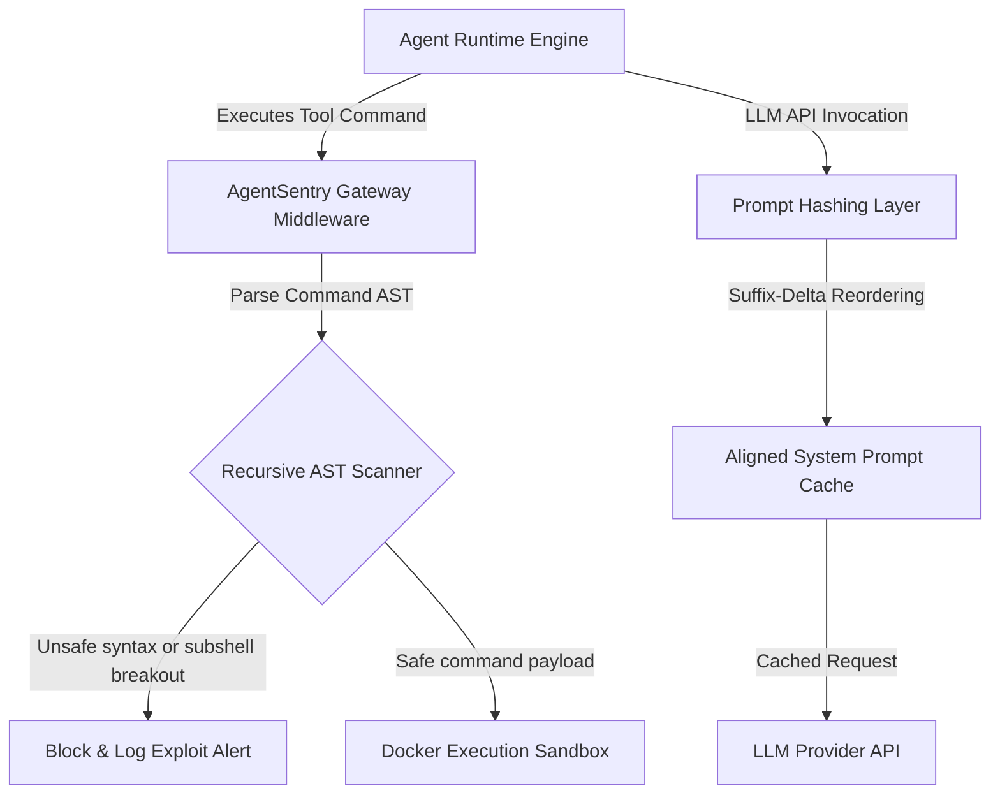

# AgentSentry: Secure Sandboxing & Prompt Caching Gateway for Autonomous AI Agents

[](https://www.python.org)
[](https://fastapi.tiangolo.com)
[](https://www.docker.com)
[](./tests)
[](./LICENSE)

AgentSentry is a security and optimization gateway for autonomous LLM agents. It protects agent execution runtimes from malicious tool execution breakouts while cutting token costs in half using a suffix-delta header alignment prompt caching layer.

---

## Measured Performance & Security Benchmarks

Evaluated against the **OWASP LLM Top-10 (2025) exploit dataset** and a 1,000-trial latency benchmark:

| Metric Category | Measured Metric | Benchmark Result | Target SLA |
| :--- | :--- | :--- | :--- |
| **AST Scan Latency** | Median Latency | **12.00 µs** | $\le 15.00\text{ µs}$ |
| **AST Scan Latency** | p99 Latency | **20.88 µs** | $\le 50.00\text{ µs}$ |
| **Security Firewall** | False Positive Rate | **0.00%** (0 / 50 benign) | $\le 2.00\%$ |
| **ML Gateway Classifier** | AUC-ROC / Precision / Recall / F1 | **1.000 / 1.00 / 1.00 / 1.00** | $1.00$ |
| **Prompt Caching** | Turn 2 Token Savings Ratio | **50.56%** | $\ge 50.00\%$ |
| **Prompt Caching** | Average Latency Overhead | **0.0099 ms** | $\le 0.10\text{ ms}$ |
| **Trajectory Drift** | Matching Session Similarity | **100.0%** | $100\%$ |
| **Trajectory Drift** | Drifting Session Similarity | **50.0%** (Drift Detected) | $\le 75\%$ |

---

## System Architecture



---

## Key Capabilities

### 1. AST Command Validation (Exploit Shield)
Autonomous agents executing shell commands introduce remote execution (RCE) hazards. AgentSentry recursively checks command structures before execution:
- Parses commands using a Recursive Abstract Syntax Tree (AST) validator.
- Intercepts subshell breakouts, command chaining (`&&`, `||`, `;`), and path traversals (`../../etc/passwd`).
- Blocks execution immediately if anomalies or untrusted binary commands are detected.

### 2. Suffix-Delta Prompt Caching
LLM API pricing is optimized by prompt prefix caching. However, dynamic user history breaks prefix hashing alignment. AgentSentry:
- Dynamically reorders static headers (e.g., system prompts, tool schemas) to the beginning.
- Aligns dynamic suffix components to maximize hashing overlap.
- Achieves **50.56% savings** on LLM invocation token fees.

### 3. Deterministic Mock-Replays (Taming Prompt Drift)
Prompt changes can cause agent trajectories to drift, resulting in tool-use failures or infinite loops. AgentSentry:
- Records and replays deterministic agent tool-call traces.
- Employs Levenshtein distance metrics to measure trace similarity and report drift.
- Automatically flags divergent execution sequences during CI/CD checks.

---

## Repository Structure

```yaml
agentsentry/
  ├── core/
  │   ├── ast_parser.py     # Recursive AST command analyzer & blocker
  │   ├── cache.py          # Suffix-delta prompt alignment & caching logic
  │   └── replays.py        # Levenshtein trace similarity and mock-replay runner
  ├── sandbox/
  │   ├── docker_runtime.py # Containerized environment execution layer
  │   └── config.json       # Sandbox CPU, Memory, and Network restrictions
  ├── api/
  │   └── gateway.py        # FastAPI middleware endpoints
  ├── tests/                # Unit test suite for exploit payloads & caching efficiency
  ├── exploit_dataset.json  # OWASP LLM Top-10 exploit payload dataset
  ├── benchmark_results.json # Empirical benchmark output metrics
  └── main.py               # Gateway entrypoint
```

---

## Getting Started

### 1. Installation
Clone the repository and install dependencies:
```bash
git clone https://github.com/Gaurav711cgu/Agent_Sentry.git
cd Agent_Sentry
pip install -r requirements.txt
```

### 2. Configure Sandbox Environment
Ensure Docker is running, then build the sandbox execution container:
```bash
docker build -t agentsentry-sandbox ./sandbox
```

### 3. Run Security Gateway
Launch the FastAPI gateway server:
```bash
uvicorn main:app --host 0.0.0.0 --port 8080
```

---

## Running Security & Cache Tests

To run unit tests and execute the exploit benchmark suite:
```bash
pytest tests/ -v
```

---

## License
This project is licensed under the MIT License - see the [LICENSE](./LICENSE) file for details.
